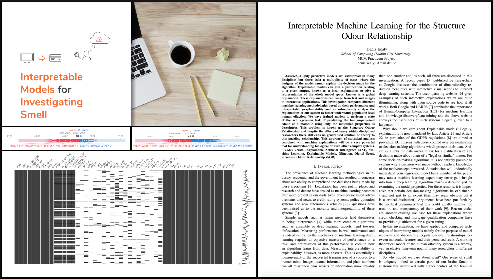

# M.Sc. in Computing Practicum (Data Analytics Major)

## Introduction

My research practicum entailed an investigation into computational discovery. Using interpretable machine learning methods my goal was to investigate viable theories of the Structure-Odour-Relationship of olfaction.
 - [Bioinformatics, Neuroscience, Scientific Writing & Machine Learning]
 
 

## Overview

Using interpretable machine learning methods, the goal of my research was to investigate viable theories of the structure-odor relationship (SOR) of olfaction. Previous SOR studies have involved the collection and modelling of a structure-percept data set. This data set maps the physical descriptors of a molecule (e.g. molecular weight) to a single, or set, of perceptual descriptors (linguistic description of a smell, e.g. ”grass”). Using this data as a training set, machine learning programs have been shown to achieve high predictive accuracy for the classification of novel and unknown odorant molecules. For the purposes of elucidating the underlying mechanics of olfaction, I proposed extending these machine learning algorithms to improve their interpretability. Explainable AI is a concept that places a requirement on the algorithm to describe/justify its output; In the context of the SOR problem, this approach helped in the causal analysis of the multivariate interactions between chemical compounds and human olfactory systems by providing a generalized solution for studying any structure-dependent chemical interaction with a complex system.

## Paper

Link to paper - https://github.com/DenisKealy/mcm-practicum/blob/master/practicum%20paper/mcm_practicum_paper.pdf

## Presentation

Link to slides - https://github.com/DenisKealy/mcm-practicum/blob/master/docs/documentation/MCM%20Practicum%20Presentation.pdf
