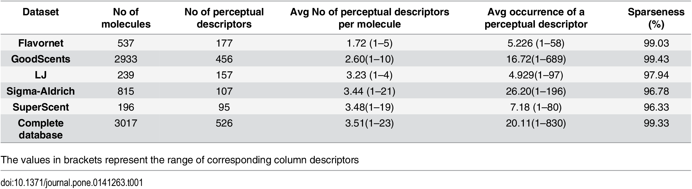
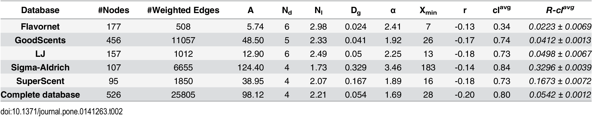
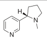

# Blog: Analysis of the Structure-Odour-Relationship

**Denis Kealy**

# Acquiring a Supervisor

On 24th October, I approached Martin Crane (of the DCU School of Computing) concerning the ideas I have for my practicum project. I uploaded an initial project proposal document which outlined multiple project directions to my gitlab repository. I met with Martin on the 3rd of November - he shared with me his concerns about the complexity of the project as well as his concerns about his fit for this type of project.  He sent me off to further investigate project ideas and to narrow down my range of project directions. We decided to set up a meeting with Tim Downing in DCU’s School of Science to avail of an expert opinion in the domain of Bioinformatics for the purposes of further investigating the complexity and feasibility of such a project.

# Meeting with School of Science faculty

I met with Tim Downing on 8th November to discuss my project ideas. For this meeting, I had focused on a singular idea which, Martin had expressed the most interest in - Explainable AI and the Structure-Odour-Relationship. I went through two papers (which were most relevant to my idea) with Tim and I showed him the data sources that I was considering using for my experimentation. He outlined his concern that the genomic and proteomic data I wanted to use was incomplete and out of date for the fast-moving field of Bioinformatics. We settled on a configurable Explainable AI system which takes molecular descriptors as it’s input to try and classify molecules based on this information. In our case we are trying to classify the molecules perceived scent but Tim noted that this approach could be used to help solve a broad range of problems such as predicting the effects of a new drug or predicting the toxicity of unknown molecules. This approach to solving the problem allows us to abstract the biological details of human olfaction processing as we are only concerned with how our machine classifies smell molecules - not the underlying biological processes by which we humans arrive at our perception.

# Project Proposal Submission

On November 10th, I replaced my initial Project Proposal document with a final version for my Project Proposal Presentation. Dr. Martin Crane assigned himself to my project in the MCM dashboard and we have scheduled to meet on 17th November. In the meantime, Martin has asked me to make a start on implementing an Explainable AI system. For use in my machine learning/classification system I shall require a heavily processed dataset. Martin suggested to do a bit of early stage modelling on a small, clean olfactory dataset to reassure myself about the project before committing myself further. I plan to use scrapy (python library) to obtain a relevant data set from flavornet (mapping of CAS number to a perceived scent). Using the CAS number we can obtain a set of physical descriptors for each molecule using software such as DRAGON or [E-DRAGON](http://www.vcclab.org/lab/edragon/). I plan to use [Mole.db](http://michem.disat.unimib.it/mole_db/) to extract the molecular descriptors for the relevant molecules in my olfaction dataset for a proof of concept-type application.

# First Official Supervisor Meeting

I met with my supervisor on the 17th of November. We discussed my progress so far. I had prepared a small dataset of 500 molecules mapped to their perceived scent - scraped from [flavornet.org](http://www.flavornet.org/flavornet.html). I ran into difficulties when I attempted to augment this dataset with a set of physical descriptors for each entry. There are inconsistencies and missing data between the different data sources. The second database (Mole.db) is a lot trickier to scrape than flavornet.org (one static page) due to the structure of the PHP pages. We discussed the topics to address in my Literature Review (and how to address them) and Martin gave me a list of deliverables for our next meeting which is scheduled for the 1st of December.

Martin's Deliverables for next Meeting:
- Do Gannt chart of work to be done
- Has to do more data pre-processing (e.g. combine DBs)
- PCA could be useful in reducing the dimensionality of the data
- With so many variables student will have to code up the PCA solver by hand
- Look at noise in the data (Random Matrix Theory)
- Do some toy coding with about 10 known descriptors & 10 random ones to test the PCA code and then scale up the code to do the full 1200
- OpenMP could be useful here

# Literature Review and Project Scheduling

To aid in my Project Approval and to get initial feedback from my supervisor I decided to write up my literature review during Week 10. This gave me time to revise my literature review and to submit the first draft to my supervisor before our meeting on Friday 1st  December.  Through the process of writing the literature review I have refined my project direction and scope. I also made a Gantt chart of the projected tasks to be completed to get a better idea of the scope and duration of this project. The Research Plan section of my Literature Review combined with the following Gantt chart is the basis for my project schedule. I plan to have a complete structure-percept dataset with some initial PCA completed for our next meeting at the end of Week 11. 

A Literature Review Document is due to be submitted for CA640 at the end of the semester. I plan to revise my Literature Review with feedback from my CA685 supervisor before submitting for CA640.

# Second Supervisor Meeting

I met with Martin Crane on the 24th of November for a brief 30-minute session. We discussed my progress thus far and in particular, we went over my literature review and project scheduling issues. Martin has continually expressed concern as to the scope and finishing point of such an investigation. He gave me advice on securing a minimum viable project while still working towards my ideal goal. It may not be possible to attempt all stages of my research plan and as such I will work to identify key stopping points that would yield sufficient results or new knowledge. I was unable to fully augment the structure-percept dataset with the appropriate chemical descriptor sets. We spoke about contacting researchers in the U.S who have collected an appropriate dataset for this investigation. This data could be used as our training data or it could be combined with freely available data sources to form the largest dataset on which such experimentation has ever been carried out. Differences between data sources remains an immediate challenge. I have decided to do some initial PCA on the dataset and to use this work for my Data Visualisation Assignment (CA682). This allows me to spend more time exploring and visualising this dataset before I begin training models with the data.

# Practicum Approval Panel Presentation

I completed my Practicum Approval Panel Presentation on Mon 4th December. Liam Touhey and Qun Liu were the two lecturers on the Panel for my time-slot. The feedback I received was similar to my supervisor's feedback - I have to be careful with the scope of this project as there are a lot of steps and quite a few potential hiccups which could hinder my progress. The main concern was that the complexity of the problem and the amount of work to be done may be too substantial for a Master's Practicum and more suited to a Ph.D. programme. I presented my idea in the following manner:

- Structure-Odor Relationship - Explanation of Problem
- Explainable AI - Explanation of Proposed Solution
- Previous Machine Learning Experiments in this area
	- 2015 Paper using publicly available datasets
	- 2017 Paper using private experimental dataset
- Background of Olfaction Processing
	- Difficulties of Problem
	- How XAI can be used in this regard
- Research Plan (Ideal Scenario)
	- Data Collection & Combination
	- Data Validation - PCA, Co-variance, Cooccurrence Networks
 	- Machine Learning Training
	- Machine Learning Testing
	- Comparing with existing solutions 
	- Integrating Interpretability with successful Model (Realistic Minimum Viable Project)
	- Examination of our models outputs
	- Discussion of Results
	- Packaging Software Release

I am taking the concerns about scope very seriously - as such I have decided re-use as much data and code as I can from previous experiments. I went to contact researchers in Rockafeller University in the U.S. over the weekend of Week 11 after my meeting with Martin. Martin's advice was: "They can only say no... or ignore you" - As neither of these outcomes would negatively affect my investigation I decided to reach out to them about their "unpublished dataset" used in a 2017 Structure-Odor-Relationship study. As it turns out a complete data set was published in a previous paper. I now have access to the full dataset used in this study - barring the chemical descriptors which I have still yet to obtain from DRAGON software or an online database. (The school of science may have a license for DRAGON which would reduce the amount of data collection/processing that I have to complete to obtain a suitable dataset for my machine learning program.)

# Further Reading and Finalising Literature Review

Literature Review Rework - My project will now be more focussed on statistical analysis; I will be training models for CA684 Machine Learning and I will investigate the XAI component later in the year than initially anticipated. As a precursor to the statistical analysis of the percept-structure dataset I performed network analysis on the perceptual data sources before combining them with the molecular descriptors. 

# Cooccurrence Network Interactive Visualisation

From one dataset I created an interactive visualisation which depicts all the smell cooccurrences in the database; each node represents a smell and edge between nodes represents a cooccurrence of those two smells. In addition the length, elasticity and width of the edges are multiplied by their weight in the corresponding cooccurrence matrix - the length is inversely adjusted. This means that more commonly cooccurring smells stick together with tight, fat edges - these effects had to be tweaked such as the decision to leave out cooccurrences that only occurred once. Omitting single cooccurrences vastly improved the visibility, user interaction and message of the visualisation.

The next post talks about the analysis of this network.

# Cooccurrence Network Analysis 

From a research article titled: *"Understanding the Odour Spaces: A Step towards Solving Olfactory Stimulus-Percept Problem"* - published in the PLOS One journal in 2015: doi.org/10.1371/journal.pone.0141263

> "We can describe each database as an undirected graph or network, where nodes are perceptual descriptors and an edge is shared by two perceptual descriptors if they have occurred together in the perceptual description of a molecule."

> "The important questions to be addressed with respect to the perceptual network are about its structural organisation, particularly, its difference from a random network and its degree distribution"

So for each dataset I aim to calculate the same network characteristics that these researchers used in their analysis and replicate their work on both their data (flavornet, good scents company), as well as newly released data(keller). In the supplementary materials of the PLOS One publication they included detailed methods of how they calculated the network statistics and how they compared it against random networks.

The aim of this exercise is to understand the quality of our data, and understand how the characteristics differ between data sources. Finally I would like to understand my results by comparing our networks to the networks constructed and analysed in 2015. 

### Data Sources analysed by Kumar Et al. 2015

### Network Characteristics from Kumar Et al. 2015

We are not going to calculate every column below - just the basic ones and most importantly the clustering coefficient with which we can compare our networks with randomly generated networks using the Erdos-Rényi method for generating random networks. From the paper:

> "The clustering coefficient can be used to differentiate the properties of the nodes from a random network. We have calculated the weighted clustering coefficient proposed by Barrat et al.[7]."

#### Columns
 
- Nodes (one for each percept that occurs at least once with another percept e.g. fish)
- Edges (one for each cooccurrence between smells - multiple cooccurrences are common and are accounted for by the weight of the edges)
- Average degree (A) is defined as two times the number of edges divided by the number of nodes
- Network diameter N(d) is the longest direct path between any two nodes in the network
- Average Path Length N(l)
- Graph Density D(g)
- ? = Power law exponent
- X(min) = Power law cutoff degree
- r = Assortativity Coefficient
- **cl(avg) = Network Average Clustering Coefficient:** We will calculate this coefficient for each dataset.
- **R-cl(avg) = Random Clustering Coefficient:** We will calculate an average clustering coefficient from our random networks of equal nodes and edges to the corresponding perceptual network.

### Flavornet Network

For this database our results closely match those of the PLOS one paper from 2015. These results help us to establish that:

A) Our data collection and cooccurrence network were completed successfully, helping to verify previous work and our own dataset
B) The data collected is significantly different to a random network

Our Average Clustering Coefficient was 0.3376... compared to 0.34 from the previous research.

Our Average Clustering Coefficient for Random Graphs was 0.02308... compared to 0.0223 reported in the previous experiments.

The z-test tells us that our real network's value for the average clustering coefficient is 1431 standard deviations away from the mean of the normally distributed values for the corresponding random graphs. The probability that our real network comes from this distribution is too small to display (due to the limits of floating point numbers) i.e. displayed as 0.0

The slight differences in the number of nodes/edges collected (2015 vs present) and the random nature of the graph generation explain the small variation in our results.

# Molecular Descriptors

I have been having trouble collecting the molecular descriptors for my molecules of interest - although I have the perceptual information I still needed the physical information pertaining to our smelly molecules. Initially, I thought the path of least resistance would be to try scrape the information from a public online database. Using scripts written in python I attempted for weeks to scrape this information and ran into several problems, mostly of my own making but one problem would have to be addressed - many of the molecules in my datasets were not listed in the database. I only discovered this, however, after weeks of attempts. Plan B was to test E-Dragon and thankfully there were very few misses.

So for E-DRAGON I needed either a 3D molecular file for the molecules in question or something called a SMILES string. This string can be converted to a 3D molecule file and uploaded to E-Dragon. SMILES stands for simplified molecular-input line-entry system and is used to describe a molecular structure using ASCII characters. Here is an example - Nicotine:

`CN1CCC[C@H]1c2cccnc2`

 To obtain the SMILES strings for the molecules in my dataset I scraped the appropriate pages from this online resource using the CAS number for each molecule => https://cactus.nci.nih.gov/chemical/structure

E-Dragon would only accept 150 molecules at a time so I split my data up into 4 splits. One file at a time I converted and calculated all but 9 of the 480 molecules using E-Dragon. That conversion rate is over 10 times better than mole.db (which is essentially a subset of molecules calculated using an older version of E-Dragon and uploaded online). Not all fields were complete in the returned data so some care will have to be taken to investigate the missing data points before processing.

We now have all the data for our most recent dataset (raw 2017 perceptual experiment - data for DREAM challenge). Next up is to look again at the timeline of the Structure-Odor-Relationship to summarise (in a digestible blog style format) what has been done and what we are attempting to do.

# Timeline of the Problem

